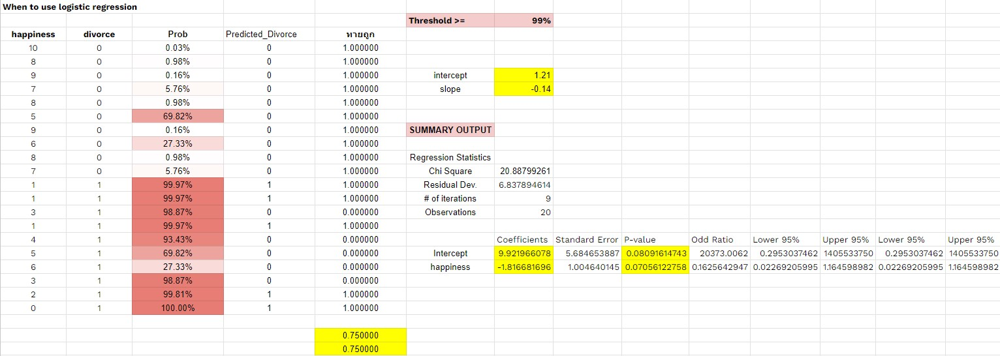
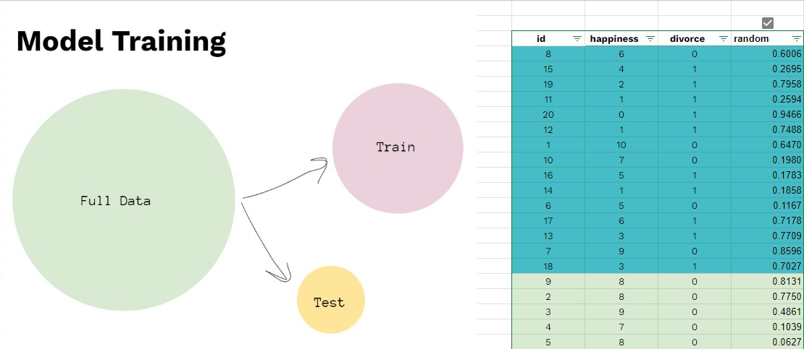
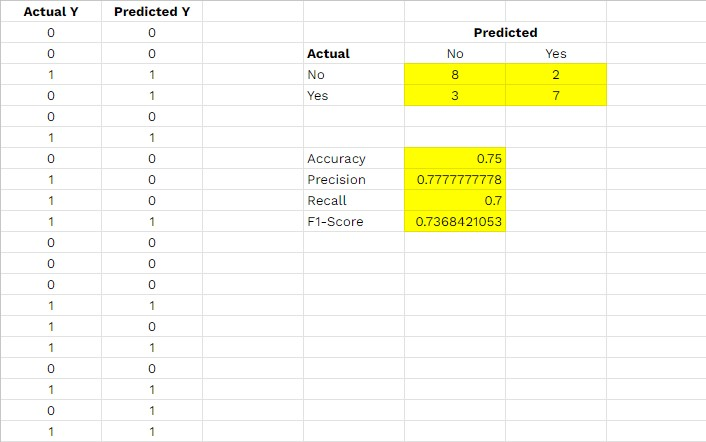

# Build The Simply Logistic Regression Project by Google Sheet

## Tools
* Google Sheet 

## Results

### 1. Manual prediction

### 2. Splitting data for training model

### 3. Evaluation model

## Read More
[View on Google Sheet](https://docs.google.com/spreadsheets/d/12jumbfku9tRdP6cRD-UBnuYk2OJ2xKoIpHTITP-ijc4/edit?usp=sharing)
