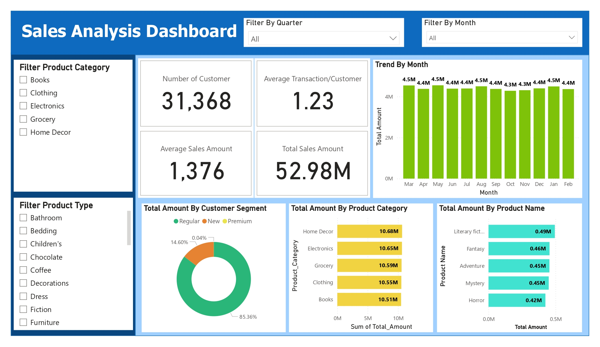

# Sales Analysis Dashboard (Using The Retail Sales Dataset)

## About Project
* This project is built on the retail sales dataset that began the fiscal year on March in every year that need to create a new dimension for the custom date. 

* It shows the overview of the total sales amount until drill into each product category and product name in last year, shows about expense in each customer segment, and shows trend of total sales amount in each month or quarter.

## Hypothesis 
1. To explore total and average income on a monthly and quarterly basis.
2. To survey the number of customers and see the total transactions over the past 1 year.
3. To know the customer segment ratio to sales amount.
4. To survey revenue in each product category and product name.

## Tools 
Power BI

## Dashboard

