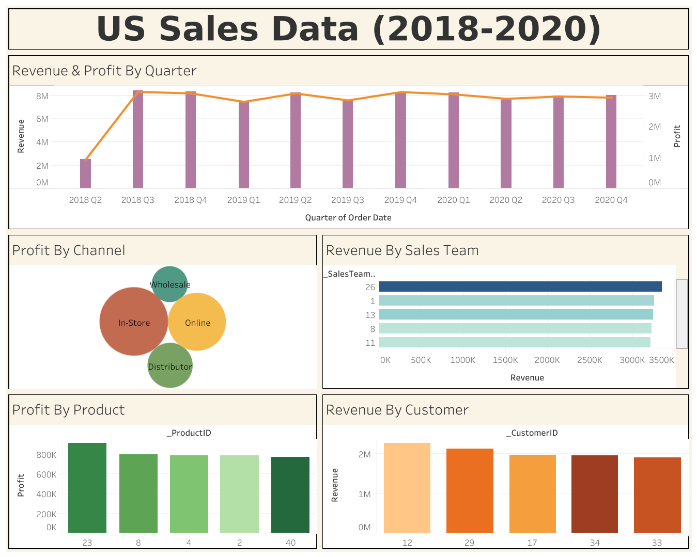

# Sales Analysis (Using US Sales Dataset)

## About Project
* This project was created from US sales dataset. It shows about revenue and profit in each dimension included channel, sales team, product category, and customer. Furthermore, it also show the total revenue and profit by quarter.

## Hypothesis 
1. To explore revenue and profit in each quarter
2. To analyze revenue/profit according to various dimensions including channels, sales teams, product categories, and customers.

## Tools 
Tableau Public

## Dashboard

[View on Tableau Public](https://public.tableau.com/views/USSalesData2018-2020/Dashboard1?:language=en-US&:sid=&:display_count=n&:origin=viz_share_link)
