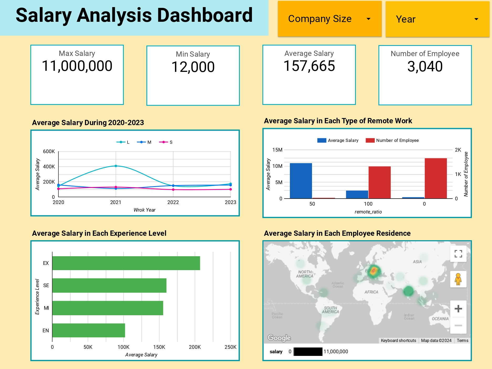

# US Salary Analysis Dashboard

## About Project
* This project is built on the salary dataset. Because this dataset contains the locations of companies in many countries, But we need to analyze only the US country. So we will filter it using PostgreSQL first, then we will create a dashboard for analysis salary in each dimension by Looker Studio.

## Hypothesis 
1. To explore min, max, and average salary and also number of employee in each company size and work year.
2. To analyze average salary across to various dimensions including type of remote work, experience work, and employee residence.

## Tools 
* PostgreSQL 
* Looker Studio

## Dashboard

[View on Looker Studio](https://lookerstudio.google.com/reporting/5c8933cf-d94d-4ec8-85ab-0dc310101103)
